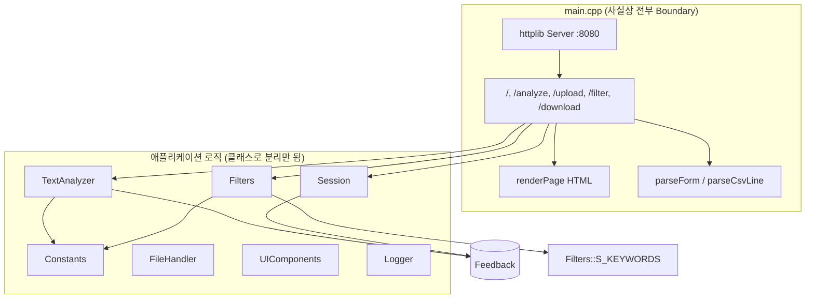
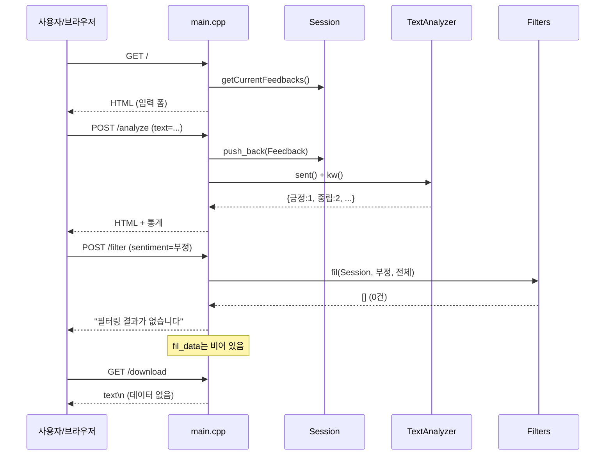
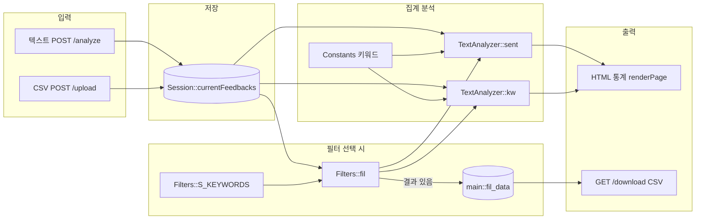
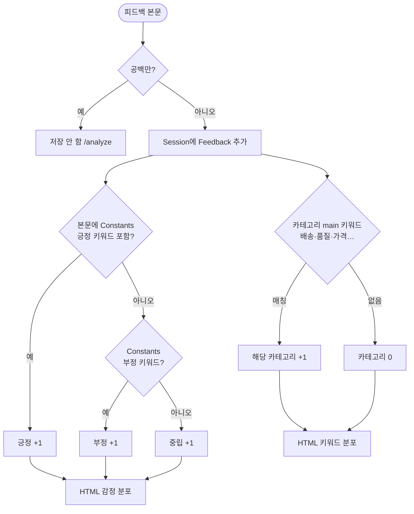
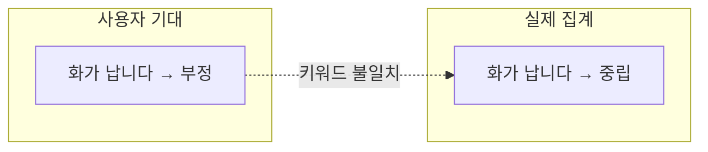
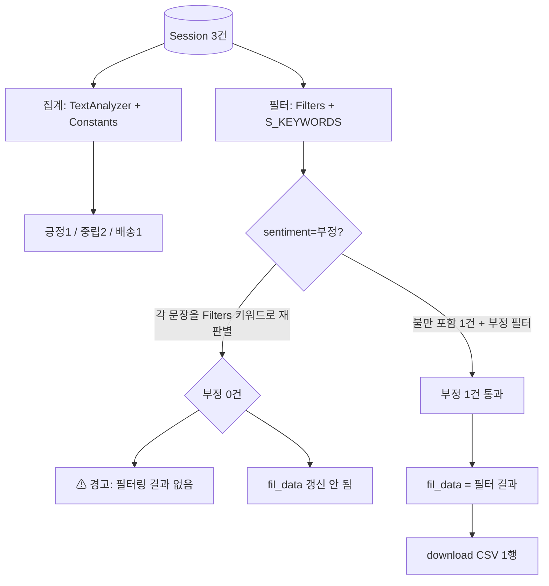
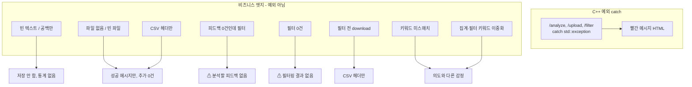

# Project structure analysis
_Exported on 5/22/2026 at 11:32:52 GMT+9 from Cursor (3.4.17)_

---

**User**

@C:\DEV\FeedbackAnalyzer_08\src

구조 분석해줘

---

**Cursor**

`src` 디렉터리 구조를 탐색해 분석합니다.


핵심 소스 파일의 역할과 의존 관계를 파악합니다.


# `src` 구조 분석

`src`는 **실행 가능한 레거시 C++ 앱**(`src/cpp`)과 **목표 동작을 정의한 Gherkin 계약**(`src/features`) 두 갈래로 나뉩니다. CMake는 `src/cpp`만 빌드하며, `tests/`·Catch2·클린 아키텍처 레이어(`boundary/control/entity`)는 아직 없습니다.

---

## 디렉터리 개요

```
src/
├── cpp/                    # 단일 실행 파일 feedback_analyzer (CMake 등록)
│   ├── main.cpp            # HTTP·라우팅·HTML·폼/CSV 파싱 (373행)
│   ├── httplib.h           # 서드파티 HTTP 서버 (헤더 온리)
│   ├── Feedback.h          # 도메인 모델 (텍스트만)
│   ├── Constants.h/cpp     # 감정·카테고리 키워드 정의
│   ├── TextAnalyzer.h/cpp  # 감정·카테고리 집계
│   ├── Filters.h/cpp       # 감정·카테고리 필터
│   ├── Session.h/cpp       # 세션 피드백 보관
│   ├── UIComponents.h/cpp  # UI용 카테고리 목록
│   ├── FileHandler.h       # 저장 스텁 (구현 .cpp 없음)
│   └── Logger.h/cpp        # 콘솔 로깅
└── features/               # 7개 .feature (빌드 미연동, 목표 스펙)
    ├── 01_sentiment_classification.feature
    ├── 02_category_keyword_classification.feature
    ├── ...
    └── EPIC_feedback_analyzer_integrated.feature
```

---

## 런타임 아키텍처 (현행)

레이어 분리 없이 **평면(flat) 모듈 + `main` 오케스트레이션** 구조입니다.



### HTTP 엔드포인트

| 메서드 | 경로 | 역할 |
|--------|------|------|
| GET | `/` | 초기 페이지 |
| POST | `/analyze` | 텍스트 입력 → `Session` 적재 → 감정·키워드 집계 |
| POST | `/upload` | CSV multipart → 첫 컬럼을 피드백으로 적재 |
| POST | `/filter` | 감정·카테고리 필터 → 재집계 |
| GET | `/download` | `fil_data` 기준 CSV 다운로드 |

---

## 모듈별 책임

| 파일 | 책임 | 비고 |
|------|------|------|
| **Feedback.h** | `text` 보유, `getText()` | 감정·카테고리 필드 없음 |
| **Constants** | `SENTIMENT_KEYWORDS`, `CATEGORY_KEYWORDS` (main + 서브그룹) | `init()`에서 하드코딩 |
| **TextAnalyzer** | `sent()`: 긍정→부정→중립 키워드 매칭 집계<br>`kw()`: **main** 키워드만 카운트 | `globalSent`/`globalKw` 정적 전역 |
| **Filters** | `fil()`: 감정은 **별도** `S_KEYWORDS`, 카테고리는 **main 제외 서브그룹**으로 필터 | `Constants`와 감정 키워드 **이중 정의** |
| **Session** | `currentFeedbacks` 정적 벡터 | `getOldDataFromSession(key)`는 key 무시 |
| **UIComponents** | 드롭다운용 5개 카테고리 | `Constants`와 목록 중복 |
| **FileHandler** | `save`/`saveResult` → `std::cout`만 | CMake에 미포함, dead code 성격 |
| **Logger** | INFO/WARNING/ERROR → cout/cerr | |
| **main.cpp** | 서버, HTML, URL decode, escape, 전역 `fil_data` | 373행 단일 파일 |

---

## 데이터 흐름 (핵심 경로)

1. **입력**: `/analyze` 또는 `/upload` → `Session::getCurrentFeedbacks()`에 `Feedback` 추가  
2. **분석**: `textAnalyzer.sent()` / `kw()` → `Constants` 키워드로 집계 → HTML 통계  
3. **필터**: `filters.fil()` → 필터 결과를 `fil_data`에 복사 → 다시 `sent`/`kw`  
4. **다운로드**: `/download`는 **`Session`이 아니라 `main`의 `fil_data`**만 사용 → 필터 없이 다운로드하면 빈 파일 가능

---

## `src/features` (목표 계약)

Gherkin은 **리팩터링 후 목표**(`UnitRegistry`, `Converter`, Hub 중립, main-only 카테고리 집계 등)를 서술합니다. 예: `EPIC_feedback_analyzer_integrated.feature`는 감정 1건/건수 합 보존/필터 정합성을 정의하지만, **현재 `src/cpp`에는 Converter·Registry가 없고** Cucumber/Catch2 스텝도 연결되어 있지 않습니다.

| Feature 파일 | 주제 |
|--------------|------|
| 01 | 감정 분류 |
| 02 | 카테고리·키워드 분류 |
| 03 | 입력 검증 |
| 04 | 필터링 |
| 05 | 대시보드·보내기·직렬화 |
| 06 | README 사용자 워크플로 |
| EPIC | 통합 시나리오 |

---

## 목표 구조 vs 현행 (`.cursorrules` / README)

문서·규칙이 기대하는 구조:

```
src/
  boundary/   # HTTP, Presenter, Validator
  control/    # AnalyzeFeedback, UploadCsv, ...
  entity/     # Feedback, UnitRegistry, Converter
  data/       # YAML/JSON Registry 로더
```

**현재는 전부 `src/cpp` 플랫 레이아웃**이며, `main.cpp`가 boundary+control+presentation을 동시에 담당합니다.

---

## 레거시 특성 (리팩터링 관점)

의도적으로 “학습용 레거시”로 보이는 지점들:

1. **감정 키워드 이중화**: `Constants::SENTIMENT_KEYWORDS`(집계) vs `Filters::S_KEYWORDS`(필터) — 목록·로직이 달라 **집계와 필터 결과가 어긋날 수 있음**  
2. **카테고리 필터 vs 집계 불일치**: `kw()`는 `main`만, `fil()`의 카테고리는 `main`을 건너뛰고 **서브그룹**만 검사  
3. **전역 mutable**: `main::fil_data`, `Session::currentFeedbacks`, `TextAnalyzer::globalSent/globalKw`  
4. **헤더에 구현**: `TextAnalyzer`, `Filters`, `FileHandler`, `Logger` 대부분 — `.cursorrules`의 “구현은 .cpp”와 불일치  
5. **FileHandler**: 선언만 있고 빌드·실사용 없음  
6. **테스트 없음**: `tests/` 디렉터리 비어 있음 — feature는 스펙 문서 역할

---

## 빌드 관계

`CMakeLists.txt`가 링크하는 소스:

- `main.cpp`, `Constants.cpp`, `Filters.cpp`, `Logger.cpp`, `Session.cpp`, `TextAnalyzer.cpp`, `UIComponents.cpp`  
- **미포함**: `FileHandler` (헤더만 존재)  
- **include path**: `src/cpp` 단일

---

## 한 줄 요약

`src`는 **cpp-httplib 기반 단일 프로세스 웹앱**으로, 키워드 규칙 분석·필터·HTML UI가 **클래스 파일로만 쪼개진 모놀리스**이고, `features/`는 **Catch2·클린 아키텍처 전환 후 맞출 BDD 계약서**입니다. 다음 단계로는 `entity` 추출(단일 Registry/Converter), `main` 분리(boundary/control), feature↔테스트 연결이 README/PRD와 정합된 방향입니다.

특정 모듈(예: `Filters` vs `TextAnalyzer` 불일치)이나 목표 레이어로의 매핑 표를 더 깊게 보고 싶으면 알려 주세요.

---

**User**

코드가 동작되는 걸 코드 실행된 상태에서 예를 들어 설명해줘

---

**Cursor**

실제로 빌드·실행한 뒤, 요청 예시로 동작 흐름을 설명하겠습니다.


서버를 재시작해 깨끗한 상태에서 시나리오를 다시 실행합니다.


실제로 `http://localhost:8080`에서 서버를 띄운 뒤 요청을 보내 본 결과를 바탕으로, **한 번의 사용 흐름**을 예시로 설명합니다.

---

## 0. 시작 — 서버가 켜지면

`main()`이 키워드 테이블을 채우고 8080 포트에서 대기합니다.

```
[2026-05-22 11:14:24] INFO: 서버가 http://localhost:8080 에서 시작됩니다.
```

브라우저에서 `http://localhost:8080` 접속 = `GET /` → 빈 `Session`으로 환영 HTML.

---

## 시나리오 A — 피드백 3건 입력 (`POST /analyze`)

### 1) 긍정 문장 입력

**사용자**: 텍스트 `"감사합니다. 정말 만족합니다."` 입력 후 [입력하기]

**HTTP** (브라우저가 보내는 것과 동일):

```
POST /analyze
Content-Type: application/x-www-form-urlencoded

text=감사합니다.+정말+만족합니다.
```

**코드에서 일어나는 일** (`main.cpp` `/analyze` 핸들러):

1. `parseForm()` → `params["text"]` 추출  
2. `Session::getCurrentFeedbacks().push_back(Feedback(text))` — **1건 저장**  
3. `textAnalyzer.sent(feedbacks)` — `Constants`의 긍정 키워드 `"감사"`, `"만족"` 매칭 → **긍정 1**  
4. `textAnalyzer.kw(feedbacks)` — 카테고리 `main` 키워드 없음 → 배송 등 0  
5. `renderPage()` → HTML에 통계 + `"1개의 피드백이 입력되었습니다."`

**서버 로그**:

```
INFO: 감사합니다. 정말 만족합니다.
INFO: 현재 1개의 피드백이 입력되었습니다.
INFO: 감성 분석 완료
INFO: 키워드 분석 완료
```

**화면 결과**: 긍정 **1**, 부정 0, 중립 0

`TextAnalyzer::sent()` 내부 로직은 대략 이렇게 동작합니다:

```27:35:src/cpp/TextAnalyzer.h
        for (const auto& f : feedbacks) {
            std::string txt = f.getText();
            std::string s = u8"중립";
            if (containsAny(txt, Constants::SENTIMENT_KEYWORDS[u8"긍정"])) {
                s = u8"긍정";
            } else if (containsAny(txt, Constants::SENTIMENT_KEYWORDS[u8"부정"])) {
                s = u8"부정";
            }
            res[s]++;
```

`"감사"`, `"만족"`이 본문에 포함되므로 **긍정**으로 분류됩니다.

---

### 2) 두 번째 문장 — “부정처럼 보이지만” 집계는 중립

**입력**: `"배송이 너무 늦어요. 화가 납니다."`

**실행 결과 (실측)**:

| 항목 | 값 | 이유 |
|------|-----|------|
| 긍정 | 1 | 1번 문장 유지 |
| 부정 | **0** | `Constants`에 `"화남"`은 있지만 본문은 `"화가"` → **부분 문자열 불일치** |
| 중립 | **1** | 긍정·부정 키워드 모두 없으면 기본값 중립 |
| 배송 | **1** | `"배송"`이 `CATEGORY_KEYWORDS["배송"]["main"]`에 매칭 |

`Constants.cpp`에는 `u8"화남"`만 있고 `"화가"`는 없습니다. 그래서 PRD/feature에서 기대하는 “부정”과 **실제 집계가 어긋납니다**.

---

### 3) 세 번째 문장 — 역시 집계는 중립

**입력**: `"전반적으로 무난했습니다."`

**실행 결과 (실측)**:

| 항목 | 값 |
|------|-----|
| 긍정 | 1 |
| 부정 | 0 |
| 중립 | **2** (2번·3번 문장) |
| 배송 | 1 |

`"무난"`은 `Filters::S_KEYWORDS`의 중립 목록에는 있지만, **`TextAnalyzer`는 `Constants::SENTIMENT_KEYWORDS`만 봅니다.** `Constants`에 중립 전용 키워드 목록이 없어서, 3번 문장도 **기본 중립**으로만 잡힙니다.

**3건 입력 후 Session 상태** (메모리):

```
[0] "감사합니다. 정말 만족합니다."     → 집계: 긍정
[1] "배송이 너무 늦어요. 화가 납니다." → 집계: 중립 (부정 아님!)
[2] "전반적으로 무난했습니다."         → 집계: 중립
```

---

## 시나리오 B — 필터 (`POST /filter`)

**사용자**: 감정=**부정**, 키워드=**전체** → [분석]

```
POST /filter
sentiment=부정&keyword=전체
```

**코드 흐름**:

1. `filters.fil(feedbacks, "부정", "전체")`  
2. `Filters::S_KEYWORDS`로 각 문장의 감정 재판별 (집계와 **다른** 키워드表)  
3. 부정으로 분류된 건 **0건** → `filtered.empty()`  
4. 경고 HTML: `"필터링 결과가 없습니다."`

**서버 로그**:

```
WARNING: 필터링 결과가 없습니다.
```

집계에서는 2번 문장이 중립인데, 필터는 “부정”만 골라내려 하니 **빈 결과**가 됩니다.  
또한 `fil_data`(다운로드용)는 필터 **성공 시에만** 채워집니다:

```329:333:src/cpp/main.cpp
            if (!feedbacks.empty()) {
                auto filtered = filters.fil(feedbacks, sentiment, keyword);
                if (!filtered.empty()) {
                    fil_data = filtered;
```

그래서 이 시점에 `GET /download` → **헤더 `text`만**, 본문 없음.

---

## 시나리오 C — 키워드가 맞을 때 (`불만` 포함)

같은 서버를 새로 띄우고 **한 건만** 입력해 본 경우:

**입력**: `"배송이 너무 늦어요. 불만입니다."`

| 항목 | 값 |
|------|-----|
| 부정 | **1** (`"불만"` ∈ `Constants` 부정 키워드) |
| 배송 | **1** |

**필터** 감정=부정 → 1건 통과 → `fil_data`에 저장.

**다운로드** `GET /download`:

```csv
text
배송이 너무 늦어요. 불만입니다.
```

(UTF-8 BOM 포함)

---

## 전체 흐름 한눈에 (브라우저 기준)



---

## CSV 업로드 (`POST /upload`) — 간단 예

`sample.csv`:

```csv
text
첫 번째 피드백
두 번째 피드백
```

1. 첫 줄(헤더) 스킵  
2. 각 데이터 줄의 **첫 번째 컬럼** → `Feedback`  
3. `/analyze`와 같이 `Session`에 누적 (이번 호출에서는 집계 HTML 없이 개수 메시지만)

---

## 실행해 보려면

```powershell
cd C:\DEV\FeedbackAnalyzer_08
.\build\feedback_analyzer.exe
```

브라우저: `http://localhost:8080`

터미널에서 curl 예:

```powershell
$body = "text=" + [uri]::EscapeDataString("감사합니다. 정말 만족합니다.")
curl.exe -X POST http://localhost:8080/analyze -d $body `
  -H "Content-Type: application/x-www-form-urlencoded"
```

콘솔에 피드백 본문·건수·분석 완료 로그가 찍히고, 응답 HTML에 `stat-number` 통계가 들어갑니다.

---

## 정리 — “동작한다”의 의미

| 단계 | 저장 위치 | 분석 엔진 | 결과 표시 |
|------|-----------|-----------|-------------|
| 입력/업로드 | `Session::currentFeedbacks` | — | 성공 메시지 |
| /analyze 직후 | 동일 Session | `TextAnalyzer` + `Constants` | 감정·카테고리 통계 |
| /filter | `fil_data` (성공 시만) | `Filters` (다른 키워드表) | 필터된 통계 또는 경고 |
| /download | `fil_data` | — | CSV |

**실행으로 확인된 핵심**: 문장 내용이 자연스러워도, **등록된 키워드 문자열과 정확히 겹쳐야** 긍정/부정이 잡힙니다. `"화가 납니다"`는 부정 0건, `"불만입니다"`는 부정 1건 — 이 차이가 레거시 키워드 방식의 실제 동작입니다.

특정 엔드포인트(예: `/upload`만)나 `Filters` vs `TextAnalyzer` 불일치를 더 깊게 따라가고 싶으면 알려 주세요.

---

**User**

<system_notification>
The following task has finished. If you were already aware, ignore this notification and do not restate prior responses.

<task>
kind: shell
status: error
task_id: 183306
title: Start HTTP server (PowerShell syntax)
detail: exit_code=4294967295
output_path: C:\Users\박성준\.cursor\projects\c-DEV-FeedbackAnalyzer-08\terminals\183306.txt
</task>
</system_notification>
<user_query>Briefly inform the user about the task result and perform any follow-up actions (if needed). If there's no follow-ups needed, don't explicitly say that.</user_query>

<system_notification>
The following task has finished. If you were already aware, ignore this notification and do not restate prior responses.

<task>
kind: shell
status: error
task_id: 456298
title: Start server in background for logs
detail: exit_code=4294967295
output_path: C:\Users\박성준\.cursor\projects\c-DEV-FeedbackAnalyzer-08\terminals\456298.txt
</task>
</system_notification>
<user_query>Briefly inform the user about the task result and perform any follow-up actions (if needed). If there's no follow-ups needed, don't explicitly say that.</user_query>

<system_notification>
The following task has finished. If you were already aware, ignore this notification and do not restate prior responses.

<task>
kind: shell
status: error
task_id: 164135
title: Start fresh server instance
detail: exit_code=4294967295
output_path: C:\Users\박성준\.cursor\projects\c-DEV-FeedbackAnalyzer-08\terminals\164135.txt
</task>
</system_notification>
<user_query>Briefly inform the user about the task result and perform any follow-up actions (if needed). If there's no follow-ups needed, don't explicitly say that.</user_query>

---

**Cursor**

백그라운드로 띄웠던 `feedback_analyzer` 서버 작업들은 **오류가 아니라 프로세스가 종료된 상태**입니다. 데모 중 포트 충돌을 막으려고 `Stop-Process`로 서버를 여러 번 끊었고, 그때 exit code `4294967295`(-1)로 기록된 것입니다.

지금은 **8080에서 서버가 돌고 있지 않습니다.** 다시 실행하려면:

```powershell
cd C:\DEV\FeedbackAnalyzer_08
.\build\feedback_analyzer.exe
```

이후 브라우저에서 `http://localhost:8080`으로 접속하면 됩니다.

---

**User**

분석된걸 그림으로 그려줘 그리고 예외가 발생될수 있는 상황도 알려주고

---

**Cursor**

예외 처리 경로와 분석 흐름을 코드에서 확인한 뒤 다이어그램으로 정리합니다.


아래 그림은 **실제 실행했을 때의 동작**과 **코드상 예외·엣지 케이스**를 함께 정리한 것입니다.

---

## 1. 전체 분석 파이프라인



**한 줄 요약**: 입력은 항상 `Session`에 쌓이고, 통계는 `TextAnalyzer`+`Constants`, 필터는 **다른 키워드表**(`Filters`)를 씁니다. CSV 다운로드는 `Session`이 아니라 **`fil_data`**만 봅니다.

---

## 2. 문장 1건이 어떻게 분류되는지 (집계)



### 실행 예시 (실측)

| 본문 | 집계 감정 | 카테고리 | 이유 |
|------|-----------|----------|------|
| `감사합니다. 정말 만족합니다.` | **긍정** | 0 | `"감사"`, `"만족"` 매칭 |
| `배송이 너무 늦어요. 화가 납니다.` | **중립** ⚠️ | 배송 1 | `"화남"`≠`"화가"`, 부정 키워드 없음 |
| `전반적으로 무난했습니다.` | **중립** | 0 | `Constants`에 `"무난"` 없음 → 기본 중립 |
| `배송이 너무 늦어요. 불만입니다.` | **부정** | 배송 1 | `"불만"` 매칭 |



---

## 3. 필터 vs 집계 — 두 갈래 길



**핵심**: 같은 문장도 **집계 엔진**과 **필터 엔진**이 다르면 결과가 갈라집니다.

---

## 4. 예외·이상 상황 맵

코드에는 `throw`가 거의 없고, 대부분 **경고 HTML** 또는 **조용한 실패**입니다.



### 상황별 표

| # | 상황 | HTTP | 사용자에게 보이는 것 | 코드 위치 |
|---|------|------|----------------------|-----------|
| 1 | **빈 텍스트** 또는 공백만 | `/analyze` | “N개 입력” (증가 없음), 통계는 기존 유지 | `text.empty()` / trim 후 미추가 |
| 2 | **`text` 필드 누락** | `/analyze` | 빈 문자열과 동일 (`map[]` 기본값) | `params["text"]` |
| 3 | **파일 미첨부** | `/upload` | 건수만 표시, 추가 없음 | `has_file` false |
| 4 | **빈 CSV** | `/upload` | 성공 메시지, 0건 추가 | `content.empty()` |
| 5 | **헤더만 있는 CSV** | `/upload` | 0건 (첫 줄 스킵) | `firstLine` skip |
| 6 | **피드백 없이 필터** | `/filter` | ⚠ `분석할 피드백이 없습니다` | L343–346 |
| 7 | **필터 0건** (예: 감정=부정인데 집계는 전부 중립) | `/filter` | ⚠ `필터링 결과가 없습니다` | L338–341 |
| 8 | **필터 없이 다운로드** | `/download` | `text` 헤더만 (본문 없음) | `fil_data` 비어 있음 |
| 9 | **키워드 부분일치 실패** | `/analyze` | 중립으로 집계 (오류 메시지 없음) | `containsAny` 부분 문자열 |
| 10 | **`std::exception`** (드묾) | 3개 POST | 🔴 `처리 중 오류…` / `파일 업로드 중…` | L282, L314, L348 |
| 11 | **`/download` 오류** | `/download` | **try/catch 없음** — 프로세스 크래시 가능성만 이론상 | L356–366 |

### `std::exception`이 날 수 있는 (이론적) 경우

현재 코드는 대부분 `throw`하지 않지만, 아래는 **가능성**이 있습니다.

- `Filters` / `TextAnalyzer`에서 `map::at("main")` — `Constants`에 `main` 없는 카테고리 추가 시
- `std::localtime` 실패 (환경 이슈, `Logger` / `getCurrentTimestamp`)
- 메모리 부족 등 표준 라이브러리 예외

실제로는 **10번보다 6~9번이 훨씬 자주** 체감됩니다. 이전 데모의 `"화가 납니다"` → 부정 0건이 대표 사례입니다.

---

## 5. 시나리오 타임라인 (그림)

```
[시작] GET /
   └─ Session: []

[입력1] "감사합니다. 정말 만족합니다."
   Session: [①]
   집계:  긍정1 중립0 부정0 | 배송0

[입력2] "배송이 너무 늦어요. 화가 납니다."
   Session: [①②]
   집계:  긍정1 중립1 부정0 | 배송1   ← ②는 중립(부정 키워드 미매칭)

[입력3] "전반적으로 무난했습니다."
   Session: [①②③]
   집계:  긍정1 중립2 부정0 | 배송1

[필터] 감정=부정
   결과: 0건 → ⚠ "필터링 결과가 없습니다"
   fil_data: (비어 있음)

[다운로드]
   CSV: text\n   (데이터 없음)
```

`불만`이 포함된 1건만 넣고 부정 필터를 쓰면:

```
Session: [불만 문장]
집계: 부정1 배송1
필터(부정): 1건 → fil_data 갱신
다운로드: text\n배송이 너무 늦어요. 불만입니다.\n
```

---

## 6. ASCII 한 장 요약

```
                    ┌─────────────────┐
   브라우저 ────────►│  main.cpp       │
                    │  httplib :8080  │
                    └────────┬────────┘
                             │
         ┌───────────────────┼───────────────────┐
         ▼                   ▼                   ▼
   ┌──────────┐      ┌─────────────┐      ┌────────────┐
   │ Session  │      │ TextAnalyzer│      │  Filters   │
   │ (전체    │      │ + Constants │      │ + S_KEYWORDS│
   │  피드백) │      │  → 집계 통계 │      │  → fil_data │
   └──────────┘      └─────────────┘      └─────┬──────┘
         │                   │                   │
         └───────────────────┴───────────────────┘
                             ▼
                      HTML / CSV 출력
```

---

정리하면, **분석 그림**은 “Session 적재 → Constants로 집계 → (선택) Filters로 걸러 fil_data → 다운로드”이고, **예외**는 C++ `catch`보다 **빈 입력·필터 0건·키워드 불일치·fil_data 미갱신**이 실사용에서 더 자주 나타납니다.

특정 경로(예: CSV 업로드만)를 더 큰 그림으로 그리거나, Mermaid를 PNG로 뽑는 방법이 필요하면 알려 주세요.

---

**User**

Report 폴더에 보고서로 작성해줘

---

**Cursor**

Report 폴더의 기존 문서 형식을 확인한 뒤 보고서를 작성합니다.


`Report` 폴더에 보고서를 추가했습니다.

| 파일 | 내용 |
|------|------|
| **[Report/02_src_레거시_동작_분석_보고서.md](Report/02_src_레거시_동작_분석_보고서.md)** | `src` 구조, HTTP·분류 파이프라인(Mermaid), 실행 실측(3건·필터·download), 예외·엣지 케이스 표, 타임라인, 리팩터링 권고 |
| **[Report/README.md](Report/README.md)** | 보고서 목록 인덱스 |

이전 대화에서 정리한 **구조 분석**, **실행 예시**, **다이어그램**, **예외 상황**을 `01_Spec.md`와 같은 형식(표·Mermaid·코드 위치)으로 맞춰 두었습니다.

