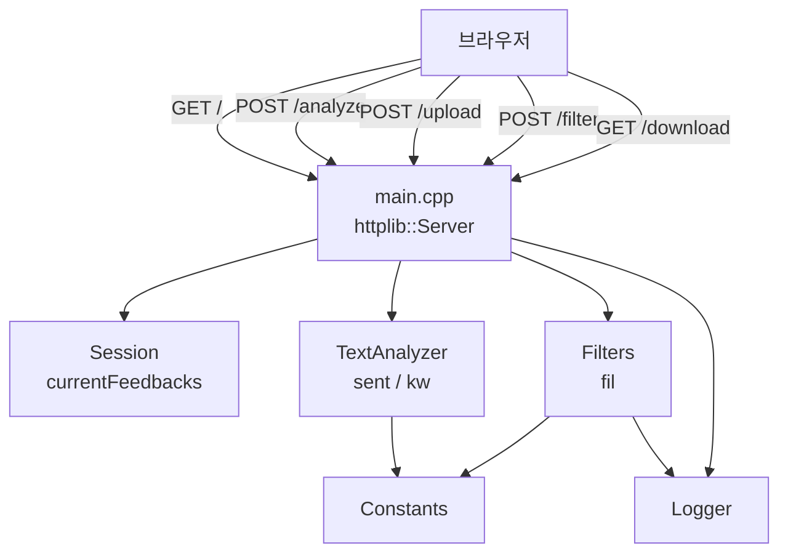

# 전체구조 및 미션 안내 분석
_Exported on 5/21/2026 at 16:58:19 GMT+9 from Cursor (3.4.17)_

---

**User**

@FeedbackAnalyzer_08 전체구조·미션안내분석해줘

---

**Cursor**

프로젝트 전체 구조와 미션 안내를 파악하기 위해 저장소를 탐색합니다.


# FeedbackAnalyzer_08 — 전체 구조·미션 안내 분석

## 1. 프로젝트 정체

**리팩토링 챌린지용 C++ 웹 앱**입니다. 고객 피드백을 키워드·감정으로 분류하고 대시보드에 보여 주는 기능을 제공하지만, **의도적으로 코드 스멜·안티패턴이 섞여 있어** 학습자가 직접 개선하는 것이 목표입니다.

| 항목 | 내용 |
|------|------|
| 기술 스택 | C++17, CMake, [cpp-httplib](https://github.com/yhirose/cpp-httplib) (`httplib.h`) |
| 실행 | `http://localhost:8080` |
| 문서 | `README.md`(사용법), `project_purpose.md`(목적·미션·스멜 목록) |

---

## 2. 디렉터리·모듈 구조

```
FeedbackAnalyzer_08/
├── CMakeLists.txt          # 단일 실행 파일 feedback_analyzer
├── README.md
├── project_purpose.md      # ★ 미션·학습 가이드 (섹션 6)
└── src/cpp/
    ├── main.cpp            # HTTP 서버, 라우팅, HTML 렌더링 (God Object)
    ├── httplib.h           # 서드파티 HTTP 라이브러리
    ├── Feedback.h          # 피드백 모델 (text만)
    ├── TextAnalyzer.h/cpp  # 감정·키워드 집계 (sent, kw)
    ├── Filters.h/cpp       # 감정·키워드 필터 (fil)
    ├── Constants.h/cpp     # 감정·카테고리 키워드 (하드코딩)
    ├── Session.h/cpp       # 전역 피드백 상태
    ├── Logger.h/cpp        # cout/cerr 로깅
    ├── UIComponents.h/cpp  # 필터 드롭다운 카테고리 목록
    └── FileHandler.h       # 미사용에 가까운 죽은 코드
```

**빌드**: `CMakeLists.txt`가 위 `.cpp` 7개 + `main.cpp`만 링크합니다. `FileHandler`는 헤더만 있고 구현·링크는 없지만 `main.cpp`에서 인스턴스를 만듭니다(실제 호출 없음).

---

## 3. 런타임 아키텍처 (요청 흐름)



| 라우트 | 역할 |
|--------|------|
| `GET /` | 세션 초기화(형식상), 빈 대시보드 |
| `POST /analyze` | 텍스트 피드백 추가 → 감정·키워드 통계 |
| `POST /upload` | CSV(`text` 컬럼) 업로드 |
| `POST /filter` | 감정·키워드 필터 → 통계 갱신 |
| `GET /download` | 필터 결과 CSV (`fil_data` 기준) |

**상태 저장소**

- `Session::currentFeedbacks` — 입력·업로드된 전체 피드백
- `main.cpp`의 `fil_data` — 마지막 필터 결과(다운로드용)
- `TextAnalyzer::globalSent`, `globalKw` — 분석 결과 전역 캐시

---

## 4. 핵심 모듈 역할 (코드 기준)

### `main.cpp` (~373줄)
- URL 디코딩, 폼 파싱, HTML 이스케이프, **`renderPage()`** 에 UI 전체 포함
- 라우트 핸들러 5개가 모두 여기에 있음 → **God Function / Spaghetti**

### `TextAnalyzer`
- `sent()`: 긍정 키워드 → 부정 → 아니면 **중립** (중립 키워드 목록은 안 봄)
- `kw()`: `Constants::CATEGORY_KEYWORDS`의 `"main"` 서브키만 사용

### `Filters`
- `S_KEYWORDS`를 `initFilterKeywords()`로 **Constants와 별도** 초기화 → **Shotgun Surgery / 중복**
- `fil()`: 감정 판별 로직이 TextAnalyzer와 다름(중립 키워드 검사 등)
- 키워드 필터 시 `"main"` 서브맵은 **건너뜀** → `"배송"`만 있는 문장이 **배송 필터에 안 잡힐 수 있음** (미션 3단계 버그 후보)

### `Constants`
- 감정·카테고리(배송/품질/가격/서비스/사용성) 키워드 **중복·하드코딩**

### `Session`
- `getOldDataFromSession(key)` — `key` 무시하고 항상 `currentFeedbacks` 반환
- `internalData`, `filterOptions` — **선언만 있고 미사용**

### `Logger`
- 항상 콘솔 출력; **페이지에 warning/error 표시 여부와 무관** (미션 3단계: level별 UI 제어)

### `FileHandler`
- `saveResult`만 콘솔 출력; **실제 파일 저장·라우트 연동 없음** (Lava Flow)

---

## 5. 미션 안내 분석 (`project_purpose.md` §6)

총 **약 13시간** 분량의 **8단계 실습 로드맵**입니다.

| 단계 | 시간 | 미션 | 현재 코드와의 연결 |
|------|------|------|-------------------|
| **1** | 1h | 개요·실습 준비, **전체 단계 미션 안내** | 지금 하신 단계 — 구조·스멜 파악 |
| **2** | 2h | **테스트 구조 + coverage 90%+** | 테스트 디렉터리·프레임워크 **없음** → 신규 구축 필요 |
| **3** | 1.5h | **버그·UX 수정** | ① 로그 level별 페이지 표시 ② textarea **multi-line** (현재 단일 textarea, 개선 여지) ③ **필터 "중립" 오류** — `TextAnalyzer` vs `Filters` 감정 판별 불일치, 키워드 필터 `main` 스킵 |
| **4** | 1h | 네이밍·매직넘버·**전역 변수** | `fil`, `sent`, `kw`, `fil_data`, `globalSent`, `globalKw` 등 |
| **5** | 1.5h | **긴 함수·중복 코드** | `renderPage()`, `main()`; `containsAny()` TextAnalyzer/Filters 이중 구현 |
| **6** | 1h | 리팩토링 기법 **1개 추가** | 문서 예: Extract Class(`HtmlRenderer`, `Router`), 전략 패턴(감정 분석) 등 |
| **7** | 3h | **추가 요구사항** | ① **Trend 시각화** (`test_feedback_trend.csv` — 저장소에 **아직 없음**, 제공 예정으로 보임) ② 감정 필터 관리 **File DB** |
| **8** | 2h | 팀 리뷰·발표 | 상대 프로젝트 리뷰 |

### 학습 목표와 매핑된 “의도적 스멜”

| 유형 | 코드에서 보이는 예 |
|------|-------------------|
| 긴 함수 | `renderPage()`, `main()` |
| 중복 | `containsAny`, 감정 키워드(Constants vs Filters) |
| 부적절한 네이밍 | `fil`, `sent`, `kw`, `res2`, `tmpFiltered` |
| 전역 상태 | `fil_data`, `globalSent`, `globalKw`, Session static |
| God Object | `main.cpp` = 서버 + HTML + CSV 파싱 |
| Lava Flow | `FileHandler`, Session 미사용 멤버 |
| 테스트 부재 | 테스트 0건 |

---

## 6. 권장 진행 순서 (미션 해석)

문서 순서를 그대로 따르는 것이 자연스럽습니다.

1. **구조 이해** → 지금 단계 완료  
2. **테스트 먼저** → `/analyze`, `/filter`, `TextAnalyzer`, `Filters` 단위·통합 테스트로 리그레션 방지  
3. **명확한 버그부터** → 중립 필터·키워드 `main` 스킵, 로그 UI 연동  
4. **리팩토링** → `renderPage`/라우트 분리, `containsAny` 공통화, Constants 단일 소스  
5. **기능 확장** → Trend CSV + File DB  

---

## 7. 한 줄 요약

**FeedbackAnalyzer_08**은 cpp-httplib 기반 피드백 대시보드이고, 비즈니스 로직은 `TextAnalyzer`/`Filters`/`Constants`에 흩어져 있으나 **실제 제어·UI·상태는 `main.cpp`와 전역/static에 몰려 있는 리팩토링 교재형 프로젝트**입니다. `project_purpose.md` §6이 **8단계 미션 로드맵**(테스트 → 버그 → 네이밍/전역 → 구조 개선 → Trend/DB)이며, 현재 코드는 3단계에서 지적한 **중립 필터·로그 UI·테스트 부재**가 가장 먼저 손대기 좋은 지점입니다.

특정 단계(예: 3단계 중립 필터 버그)부터 구현·수정을 진행할까요?

---

**User**

Report 폴더에 보고서로 작성해줘

---

**Cursor**

이전 분석 내용을 바탕으로 `Report` 폴더에 보고서를 작성합니다.


`Report` 폴더에 보고서를 작성해 두었습니다.

**경로:** [Report/FeedbackAnalyzer_08_구조_미션_분석_보고서.md](c:\DEV\FeedbackAnalyzer_08\Report\FeedbackAnalyzer_08_구조_미션_분석_보고서.md)

**구성 요약**

| 섹션 | 내용 |
|------|------|
| 1. 요약 | 프로젝트 정체·핵심 결론 |
| 2~3 | 목적·학습 목표, 기술 스택·빌드 |
| 4~5 | 디렉터리 구조, 기능 명세 |
| 6~7 | HTTP 라우트, 모듈별 상세 분석 |
| 8 | 의도적 코드 스멜·안티패턴 |
| 9 | 8단계 미션(§6) 표·우선순위 |
| 10~11 | 개선 포인트·리스크, 결론 |
| 부록 | 참고 파일·용어 |

이전 대화에서 정리한 전체 구조·미션 안내·버그 후보(중립 필터, 키워드 `main` 스킵 등)를 보고서 형식으로 정리했습니다. PDF나 영문 버전이 필요하면 알려 주세요.

