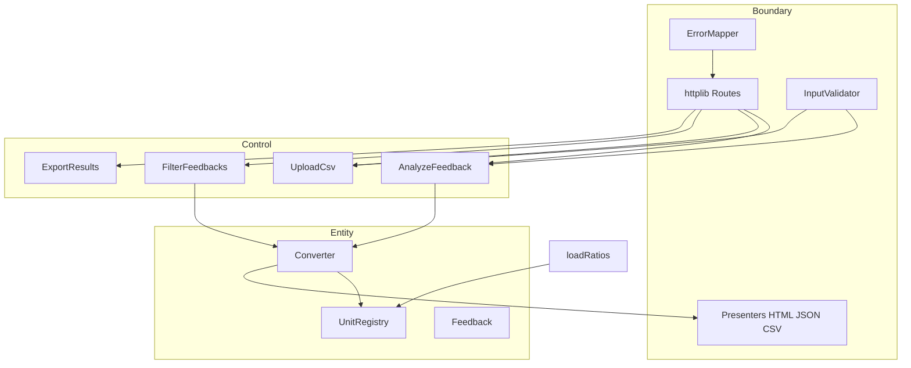

# Feedback Analyzer


고객 피드백 분석 시스템은 자연어 기반 고객 피드백 데이터를 수집, 분류, 시각화하는 기능을 제공하는 C++ (cpp-httplib) 기반 웹 애플리케이션입니다.

## 주요 기능

- 텍스트 피드백 입력 (수동/CSV 업로드)
- 키워드 기반 피드백 분류
- 감정 분석 (긍정/부정/중립)
- 피드백 필터링 및 검색
- 분석 결과 시각화
- 결과 CSV 다운로드

## 요구사항

- C++17 이상 지원 컴파일러 (MSVC, GCC, Clang)
- CMake 3.14 이상

## 설치 방법
저장소 클론
```
git clone [repository-url]
cd feedback_analyzer_cpp
```

## 빌드 방법
```
rmdir /q /s build
cmake -S . -B build -G "MinGW Makefiles" -DCMAKE_CXX_COMPILER=C:/mingw64/bin/g++.exe
cmake --build build
```

## 실행 방법
```
build\feedback_analyzer.exe
```

## 프로젝트 구조

```
feedback_analyzer_cpp/
├── src/cpp/
│   ├── main.cpp           # HTTP 서버 및 라우팅 (cpp-httplib 기반)
│   ├── httplib.h           # cpp-httplib 헤더 라이브러리
│   ├── Feedback.h          # 피드백 데이터 모델
│   ├── TextAnalyzer.h/cpp  # 텍스트 분석 로직
│   ├── Filters.h/cpp       # 필터링
│   ├── UIComponents.h/cpp  # UI 컴포넌트
│   ├── Session.h/cpp       # 상태 관리
│   ├── Logger.h/cpp        # 로깅
│   ├── Constants.h/cpp     # 상수 정의
│   └── FileHandler.h       # 파일 처리
├── CMakeLists.txt          # CMake 빌드 설정
├── project_purpose.md      # 프로젝트 목적 문서
└── README.md               # 프로젝트 설명
```

## 사용 방법

1. 웹 브라우저에서 `http://localhost:8080` 접속
2. 피드백 텍스트 입력 또는 CSV 파일 업로드
3. 감정/키워드 필터로 결과 필터링
4. 필요시 결과 다운로드

## CSV 파일 형식

입력 CSV 파일은 다음과 같은 형식이어야 합니다:
- 필수 컬럼: `text`
- 텍스트 컬럼에 피드백 내용 포함

---
//여기서 부터 수정가능
# FeedbackAnalyzer (C++) — Legacy Code 리팩토링

규칙 기반 피드백 감정·카테고리 분석을 **단일 Registry·Converter**와 **검증 가능한 입출력 계약**으로 정리하는 C++ 웹 **학습 저장소**이다. C++17·클린 아키텍처·TDD를 실습하는 학습자가 레거시(`src/cpp`)에서 **BCE·Catch2·Gherkin**으로 전환해 집계·필터·출력 불일치를 제거한다. 정본: [docs/PRD.md](./docs/PRD.md) · [docs/01_요구사항_서술_패키지.md](./docs/01_요구사항_서술_패키지.md).

> **문서 정책**: 위 **상단(1~72행)** = 레거시 **현행 제품** 스냅샷(빌드·실행·`feedback_analyzer_cpp` 예시명). **본 절(73행~)** = Phase 5 **인수·계약** 정본. 불일치 시 **PRD 우선**. 클론·경로 정본: **`FeedbackAnalyzer_08`**.

> **`UnitRegistry`·`Converter`**: meter/feet/cubit·비율 `3.28084`/`1.09361` **해당 없음**. 감정·카테고리 **규칙 저장소·판별 엔진** 목표명. `src/cpp`에는 **아직 없음** — `Constants`·`TextAnalyzer`·`Filters`가 현행.

## 목차

- [Phase 5 목표·인수 기준](#phase-5-목표인수-기준)
- [RED 단계 To-Do 리스트](#red-단계-to-do-리스트)
- [개요 (Overview)](#개요-overview)
- [빠른 시작 (Quick Start)](#빠른-시작-quick-start)
- [지원 감정·카테고리](#지원-감정카테고리-및-분류-규칙)
- [입력·오류 계약](#입력-형식-계약)
- [아키텍처](#아키텍처)
- [설정·동적 Unit (DR-03)](#설정-파일-jsonyaml--동적-unit-dr-03)
- [출력 포맷](#출력-포맷)
- [테스트·커버리지](#테스트-실행)
- [생성형 AI Activities (6시간)](#생성형-ai-활용-activities-6시간)
- [기여 가이드](#기여-가이드)
- [라이선스](#라이선스)

## RED 단계 To-Do 리스트

> 이 체크리스트는 [docs/test_plan.md](./docs/test_plan.md) 기반으로 생성되었습니다.
> 각 항목은 **RED(실패 테스트 작성) 완료** 시 체크합니다. (스텁 GREEN ≠ 레거시 수정 완료)
>
> **현황 (2026-05-22)**: Catch2 스켈레톤 **38건** (`FAIL("RED")` only) · ctest **0/38 PASS** · 구현(GREEN) **미착수** · 레거시 [`src/cpp`](./src/cpp) [DEF-L01~L09 Open](./docs/defect_list.md)

### Track A — UI / Boundary 테스트 (7/7 스켈레톤 작성 · 전부 RED)
- [x] TC-A-01: POST analyze text=""·"\t\n" → EMPTY_TEXT — `test_parse_plain_empty_text_returns_empty_text`
- [x] TC-A-02: parse("만족합니다") → COLON_MISSING — `test_parse_labelbody_colon_missing_throws_colon_missing`
- [x] TC-A-03: parse("화남:짜증납니다") → UNKNOWN_EMOTION — `test_parse_labelbody_unknown_emotion_rejects_hub_substitute`
- [x] TC-A-04: CSV foo,bar → CSV_MISSING_TEXT_COLUMN — `test_upload_csv_missing_text_column_rejects`
- [x] TC-A-05: POST trim 앵커 — `test_analyze_trim_anchor_stored_text`
- [x] TC-A-06: filter(부정,배송) 1건 — `test_filter_negative_shipping_session_one_item`
- [x] TC-A-07: CSV download 1행 / 빈 fil_data 404 — `test_download_csv_anchor_one_data_row` · `test_download_empty_fil_data_returns_not_found`

### Track B — Domain / Logic 테스트 (7/7 스켈레톤 작성 · 전부 RED)
- [x] TC-B-01: classify(앵커) → 부정 — `test_classify_anchor_text_returns_negative`
- [x] TC-B-02: aggregate(앵커) → 부정=1 배송=1 — `test_aggregate_anchor_single_negative_and_shipping_one`
- [x] TC-B-03: 택배만/main 경계 — `test_aggregate_subkeyword_only_shipping_zero`
- [x] TC-B-04: filter(부정,배송) — `test_filter_negative_shipping_returns_anchor_only`
- [x] TC-B-05: 긍·부 공존 → 긍정 — `test_classify_coexisting_keywords_returns_positive`
- [x] TC-B-06: 화가 납니다 / 앵커 — `test_classify_near_negative_purpose_line_returns_negative` · 레거시 Open [DEF-L01](./docs/defect_list.md)
- [x] TC-B-07: 합=3 · Hub 중립 — `test_aggregate_three_feedbacks_sum_equals_three` · `test_classify_neutral_text_returns_hub_neutral`

### 보조 스켈레톤 (Track 외 · RED)
- [x] Domain `registerUnit` 5건 — `tests/domain_tests.cpp` `[domain][register][red]`
- [x] Boundary 파싱·필터 7건 — `tests/boundary_tests.cpp` (EMPTY_LABEL/BODY, FilterValidator)
- [x] Data JSON/YAML 10건 — `tests/data_tests.cpp`

### 커버리지 목표
- [ ] Domain Logic: COV-01 build-cov ENABLE_COVERAGE ctest domain lcov extract entity → lines>=95% branches>=90%
- [ ] Boundary Layer: COV-02 ctest boundary lcov extract main.cpp genhtml report-main → lines>=85% branches>=80%
- [ ] COV-03 ctest domain+boundary coverage.info summary + check_coverage.sh → overall line>=90% branch>=85%

### 결함 목록 연결
- [x] [docs/defect_list.md](./docs/defect_list.md) 생성 및 발견 결함 기록 (DEF-001~008 스텁, DEF-L01~L10 레거시)
- [ ] 모든 결함 수정 후 회귀 테스트 통과 확인 (현재 ctest **0/38** · 레거시 DEF-L01~L09 **Open**)

---

## Phase 5 목표·인수 기준

### 측정 목표 (PRD G-01~G-05)

| ID | 목표 | 측정 |
|----|------|------|
| G-01 | `classify`·`aggregate`·`filter` **100% 일치** | 골든 N≥20, IT 불일치 0 |
| G-02 | 레이어별 **커버리지 하한** | [테스트·커버리지](#테스트-실행) 표 |
| G-03 | Catch2·Gherkin **전부 GREEN** | `[domain]` `[boundary]` `[data]` 100%; GH-01~13·README-01~08 |
| G-04 | `error.code`·스키마 **동결** | 실패 시 `field`·`message`·`httpStatus` |
| G-05 | 금지 패턴 0 | 이중 SENTIMENT, 전역 mutable, Entity `cout` |

### 비목표 (NG-01~03)

ML·딥러닝 감정 분석, **Trend/File DB/프로덕션 배포**(`project_purpose` 8단계 중 해당 항목), 대규모 말뭉치 벤치마크 — Phase 5 v1.0 **범위 외**.

### 인수 기준 (AC-01~AC-07)

- [ ] **AC-01** 골든 N≥20: `tests/fixtures/golden_feedbacks.yaml` — classify/aggregate/filter 불일치 0
- [ ] **AC-02** Catch2 `[domain]` `[boundary]` `[data]` 전부 PASS
- [ ] **AC-03** Domain line ≥95%, branch ≥90%
- [ ] **AC-04** GH-01~13, **README-01~08** 각각 Catch2 또는 IT 1:1
- [ ] **AC-05** README-04: 부정+배송 필터 1건 → CSV 데이터 1행
- [ ] **AC-06** `EMPTY_TEXT`·`CSV_MISSING_TEXT_COLUMN`·`UNKNOWN_EMOTION` — HTTP·code·field 일치
- [ ] **AC-07** 이중 SENTIMENT·전역 mutable **0건**

완료 증거: [요구사항 패키지](./docs/01_요구사항_서술_패키지.md) **Level 5 체크리스트 42항** + SC-01~07.

---

## 개요 (Overview)

### 이 프로젝트가 해결하는 문제 (PRD §1.2)

| 현상 | 원인 (`src/cpp` 레거시) |
|------|-------------------------|
| 같은 문장인데 통계·필터·CSV 결과가 다름 | `TextAnalyzer`와 `Filters`가 **서로 다른 키워드·우선순위** |
| 입력 오류가 빈 화면·모호한 경고만 | `main.cpp`에 HTTP·HTML·분류·전역 상태 혼재, `error.code` 없음 |
| 규칙 변경 시 여러 파일 수정 | `Constants`·`Filters` 하드코딩·if-else, Shotgun Surgery |
| 출력마다 다른 가정 | HTML·CSV가 동일 `AnalysisSnapshot` 없이 직렬화 |

### 주요 학습 목표

| 원칙 | 적용 |
|------|------|
| **SRP** | Entity(판별) · Control(유스케이스) · Boundary(HTTP·검증·표현) 분리 |
| **OCP** | 새 감정·카테고리 → Registry·Presenter만; Converter 분기 난립 금지 |
| **BCE** | `boundary → control → entity` |
| **TDD** | Catch2 RED→GREEN→REFACTOR; Gherkin ↔ 테스트 1:1 |

### 현재 코드의 문제점과 개선 방향

| Before (현행 `src/cpp`) | After (목표 `src/`) | 비고 |
|-------------------------|---------------------|------|
| `Constants` — 키워드·우선순위 하드코딩 | **`UnitRegistry`** — 규칙 단일 저장소 | `loadRatios` / `registerUnit` |
| `TextAnalyzer` + `Filters` — 이중 `containsAny`·감정 규칙 | **`Converter`** — `classify`·`aggregate`·`filter` | 집계·필터·단건 **동일 Registry** |
| `main.cpp` — HTTP·`renderPage()`·분류 혼재 | **Boundary** + **Control** 유스케이스 | Entity만 Registry·Converter |
| `globalSent`, `fil_data` 전역 | 세션 포트 · **`AnalysisSnapshot`** | Presenter 입력 DTO 통일 |
| `renderPage` HTML 혼재 | `HtmlPresenter` / `JsonPresenter` / `CsvPresenter` | 동일 스냅샷 직렬화 |

**레거시 → 목표 매핑 (Entity)**

| 레거시 | 목표 | 역할 |
|--------|------|------|
| `Constants::SENTIMENT_KEYWORDS`, `CATEGORY_KEYWORDS` | `UnitRegistry` | Hub·우선순위·키워드 **유일 공급** |
| `TextAnalyzer::sent()`, `kw()` | `Converter::aggregate` (등) | 통계·카테고리 집계 |
| `Filters::fil()` (+ 별도 `S_KEYWORDS`) | `Converter::filter` | 필터도 **같은** 분류 규칙 |
| (분산된 if-else 매칭) | `Converter::classify` | 피드백 1건당 감정 1개 |

- 위 표의 `UnitRegistry` + `Converter`는 **클래스 rename이 아니라** `Constants`·`TextAnalyzer`·`Filters` **중복 제거 후 새로 추출**하는 목표 구조이다.
- **인수 기준**은 Entity만이 아니라 **BCE 전체**(Validator, Control, Presenter, Catch2) — [아키텍처](#아키텍처-1) 참고.
- `Filters::fil`은 카테고리 `main` 외 서브 키워드까지 보는 등 **목표 Converter·Gherkin과 다를 수 있음**(RED 정상).
- 상단 트리 `FileHandler.h` “파일 처리”는 **Lava Flow**(실제 미사용) — 감정·Registry 계약과 **무관**.

---

## 빠른 시작 (Quick Start)

### 사전 조건

- **C++17+** (MSVC, GCC, Clang)
- **CMake 3.14+**

### 빌드 & 실행

상단 [빌드 방법](#빌드-방법)·[실행 방법](#실행-방법)과 동일:

```bash
cmake -S . -B build -G "MinGW Makefiles" -DCMAKE_CXX_COMPILER=C:/mingw64/bin/g++.exe
cmake --build build
build\feedback_analyzer.exe
```

브라우저: **http://localhost:8080**

### 예시 입출력

| 입력 | 기대 (목표 계약) |
|------|------------------|
| `POST /analyze` · `text=친절한 서비스에 감사합니다` | HTTP 200, HTML **감정 분포** 긍정 ≥1, **키워드** 서비스 ≥1 |
| `POST /upload` · CSV `text` 헤더 3행 | 세션 3건 |
| `POST /filter` · 감정 `부정` + 카테고리 `배송` | 필터 1건 |
| `GET /download` | CSV `text` 헤더, 데이터 행 = 필터 건수 |

> 레거시는 집계·필터·중립 처리가 PRD/Gherkin과 **RED**일 수 있음 — 불일치 재현이 출발점.

**README E2E (AC-04):** README-01~08 — 접속·CSV·analyze·필터·다운로드·입력 검증 등 ([`src/features/06_readme_user_workflows.feature`](./src/features/06_readme_user_workflows.feature)).

---

## 지원 감정·카테고리 및 분류 규칙

Gherkin Background (C-D01~D06): Registry 기본 스냅샷 · Hub `중립` · 우선순위 `긍정→부정→중립` · 카테고리 5종 · 감정 1개/건 · 카테고리 **main** 매칭만.

길이·환산(`meter`/`feet`/`cubit`, `3.28084`/`1.09361`) **도메인 외**.

### 감정 Unit

| 단위명 (표시) | 식별자 (unitId) | type | 역할·우선순위 |
|---------------|-----------------|------|---------------|
| 긍정 | `긍정` | sentiment | 1순위 |
| 부정 | `부정` | sentiment | 2순위 |
| 중립 | `중립` | sentiment | **Hub** — 3순위, 미매칭 귀속 |

**고정:** `긍정` → `부정` → `중립`

### 카테고리 Unit (main 키워드)

| 단위명 | unitId | type | main 키워드 조건 |
|--------|--------|------|------------------|
| 배송 | `배송` | category | 배송·택배·배달 등 |
| 품질 | `품질` | category | 품질·재질·고장 등 |
| 가격 | `가격` | category | 가격·비싸·할인 등 |
| 서비스 | `서비스` | category | 서비스·상담·친절 등 |
| 사용성 | `사용성` | category | 사용·설명서·어렵 등 |

---

## 입력 형식 계약

### 공통

- UTF-8, **trim** 적용, 권장 상한 **10 000자**
- 실패 응답: `{ "error": { "code", "message", "field", "httpStatus" } }`
- 검증·필터 실패 시 **세션·Registry 불변**

### 정상 (예시)

| # | 형식 | 예시 |
|---|------|------|
| 1 | `POST /analyze` · `text=` | `text=배송이 빨라서 만족합니다` |
| 2 | `<sentimentId>:<body>` (`:` 1개, 라벨·본문 비공백) | `긍정:친절한 서비스에 감사합니다` |
| 3 | `POST /upload` CSV | 헤더 **`text`** + data rows |

### 필터 (`POST /filter`)

| 파라미터 | 허용 값 |
|----------|---------|
| `sentiment` | `전체`, `긍정`, `부정`, `중립` |
| `keyword` | `전체` 또는 Registry category id (`배송` 등) |

### 오류 code (대표)

| code | HTTP | field (예) | 조건 |
|------|------|------------|------|
| `EMPTY_TEXT` | 400 | `text` | 빈·공백 |
| `CSV_MISSING_TEXT_COLUMN` | 422 | `file` | CSV 헤더에 `text` 없음 |
| `COLON_MISSING` | 400 | `text` | `:` 없음 |
| `EMPTY_LABEL` | 400 | `text` | 라벨 공백 |
| `EMPTY_BODY` | 400 | `text` | 본문 공백 |
| `UNKNOWN_EMOTION` | 400 | `text` | 미등록 라벨 — **Hub 치환 금지** |
| `UNKNOWN_CATEGORY_FILTER` | 400 | `keyword` | 미등록 카테고리 필터 |
| `UNKNOWN_SENTIMENT_FILTER` | 400 | `sentiment` | 미등록 감정 필터 |
| `DUPLICATE_UNIT` | 400 | — | `registerUnit`/`loadRatios` 중복 id |
| `CONFIG_PARSE_ERROR` | 400 | — | YAML 파싱 실패 |
| `INVALID_HUB_CONFIG` | 400 | — | Hub ≠ `중립` 또는 우선순위 불일치 |
| `UNSUPPORTED_CONFIG_VERSION` | 400 | — | `version` 미지원 |
| `NO_DATA_TO_EXPORT` | 404 | — | `fil_data` 빈 CSV 다운로드 |

건수·count **0 미만 금지**(물리 단위 “음수”는 해당 없음).

---

## 아키텍처

**`UnitRegistry`**: 감정·카테고리 Unit(id, keywords, Hub, 우선순위)만 보관 — **변환 비율·meter/feet 없음**.  
**`Converter`**: Registry만 읽어 `classify` / `aggregate` / `filter` 수행 — **길이 환산 API 아님**.

### BCE 레이어 (Mermaid)



### 의존성 방향

```
boundary → control → entity
금지: entity → httplib / HTML / filesystem (core)
```

### 새 Unit 추가 (코드 최소화)

| 단계 | 작업 | Converter 변경 |
|------|------|----------------|
| 1 | Domain RED 테스트 + 키워드 문장 | 없음 |
| 2 | `ratios.yaml` 또는 `registerUnit` | 없음 |
| 3 | GREEN — classify=aggregate=filter 일치 | 없음 |
| 4 | (선택) Presenter·필터 옵션 | Presenter만 |

---

## 설정 파일 (JSON/YAML) · 동적 Unit (DR-03)

**현행**: `Constants::init()` 하드코딩만 — `loadRatios`·`registerUnit`·`config/ratios.yaml` **미구현**(목표: `src/data` + `UnitRegistry`).

| 경로 | 용도 |
|------|------|
| `config/ratios.yaml` | 기본 Registry 스냅샷 (목표) |
| `tests/fixtures/registry_default.yaml` | `loadRatios` 테스트 |
| `tests/fixtures/golden_feedbacks.yaml` | 골든 N≥20 (AC-01) |

### `loadRatios` (일괄 교체)

- 성공: `UnitRegistry.replaceAll(snapshot)` — 이후 classify/aggregate/filter **동일 스냅샷**
- 실패: Registry **변경 없음** — `CONFIG_PARSE_ERROR`, `UNSUPPORTED_CONFIG_VERSION`, `INVALID_HUB_CONFIG`, `DUPLICATE_UNIT`

### YAML 스키마 (정본)

```yaml
version: 1
hub:
  sentiment: "중립"
priority:
  sentiment: ["긍정", "부정", "중립"]
units:
  - type: sentiment
    id: "긍정"
    keywords: ["좋아요", "만족", "감사"]
  - type: category
    id: "배송"
    keywordGroups:
      main: ["배송", "택배", "배달"]
```

- 집계·건수: 카테고리 **`keywordGroups.main`만**(C-D06). 레거시 `Constants` 서브 그룹(`time`/`type_` 등)은 v1.0 **미이전**.

### `registerUnit` (런타임 추가)

```text
registerUnit(type=sentiment, unitId=만족, keywords=[만족, 만족스럽])
registerUnit(type=category, unitId=포장, keywordGroups.main=[포장, 박스])
```

- 성공: 직후 `classify`·`filter` 반영
- 중복 `(type, unitId)` → `DUPLICATE_UNIT`, 스냅샷 **불변**
- Hub·`priority.sentiment` **단건 변경 불가** — `loadRatios` 전체 교체만

### 금지 (DR-03-D)

`meter`/`feet`/`cubit`, `3.28084`/`1.09361`, `convert(…)`, Converter 내 감정별 `if (id=="긍정")` 분기.

---

## 출력 포맷

동일 `AnalysisSnapshot` → Presenter 분기 (OCP).

### HTML (현행 · `main.cpp` `renderPage`)

```html
<!-- 논리 구조 -->
<section>감정 분포</section>   <!-- 긍정/부정/중립 count -->
<section>키워드 분석</section> <!-- 카테고리 count -->
<table><!-- feedback texts --></table>
```

### JSON (목표 · OR-02)

```json
{
  "sentimentStats": [
    { "id": "긍정", "count": 2 },
    { "id": "부정", "count": 1 },
    { "id": "중립", "count": 0 }
  ],
  "categoryStats": [
    { "id": "배송", "count": 1 }
  ],
  "feedbacks": [
    { "text": "배송이 늦어서 불만입니다" }
  ]
}
```

실패 시: `{ "error": { "code", "message", "field" } }`. `count` ≥ 0.

### CSV (`GET /download` · OR-03)

- MIME: `text/csv; charset=UTF-8`
- `Content-Disposition: attachment; filename="filtered_feedback.csv"`
- 헤더 `text` 1열; 데이터 = `fil_data` 각 행
- 빈 `fil_data` → `NO_DATA_TO_EXPORT`, HTTP **404**
- BOM 선택 허용

```csv
text
배송이 늦어서 불만입니다
```

### HTML 표 (목표 · OR-04)

- 행 수 = 화면 `feedbacks` 건수; 행별 sentiment = `classify(text)`
- `<`, `>`, `"`, `&` **escape** — raw `<script>` **0건**(GH-13)
- 권장 열: `text`, `sentimentId`, `categories`

### Logger (보조)

분석 정본은 HTML/JSON/CSV. F-03 Logger level 권장. Entity `cout` 디버그 **금지** ([`.cursorrules`](./.cursorrules)).

---

## 테스트 실행

**도구**: Catch2 **v3**, `ctest`, clang-format (`.clang-format`).

### 앱 빌드 (현행 · AC 아님)

```bash
cmake -S . -B build && cmake --build build
```

> 레거시 빌드 성공 ≠ AC-01~07 충족.

### Catch2 · ctest (목표 · 필수)

```bash
cmake -S . -B build && cmake --build build
ctest --test-dir build -V
```

| 태그 | 경로 | 커버리지 (line / branch) |
|------|------|--------------------------|
| `[domain]` | `tests/domain/` | ≥ 95% / ≥ 90% |
| `[boundary]` | `tests/boundary/` | ≥ 85% / ≥ 80% |
| `[data]` | `tests/data/` | ≥ 90% / ≥ 85% |
| `[integration]` | `tests/integration/` | Overall ≥ 90% / ≥ 85% |

> 현재 `CMakeLists.txt`는 `feedback_analyzer`만 빌드 — Catch2·`[data]`는 **리팩토링 목표(필수)**.

### Gherkin 매핑

- Domain: GH-01~13 ([`src/features/`](./src/features/))
- E2E: **README-01~08** (워크숍 최소 01~04, 인수는 **전부**)

---

## 생성형 AI 활용 Activities (6시간)

Legacy 리팩토링 워크숍 (`project_purpose.md` 압축).

| 시간 | Activity | AI 활용 | 산출물 |
|------|----------|---------|--------|
| 0.5h | 레거시 불일치 재현 | analyze/filter/compare 표 정리 | Before 목록 |
| 1h | 계약·RED 테스트 | PRD·Gherkin → Catch2 제목·error.code | RED 목록 |
| 1.5h | Domain GREEN | Registry+Converter, 이중 Rule 제거 검토 | `tests/domain` |
| 1h | Boundary | Validator/Presenter Fake, main 분리 | `tests/boundary` |
| 1h | README E2E·골든 | **README-01~08**, golden N≥20 | fixtures·IT |
| 1h | 회귀·리뷰 | Level 5 **42항**·커버리지 게이트 | 발표 노트 |

> 워크숍 표는 01~04 **최소**; 인수 **AC-04**는 README-01~08·GH-01~13 **전부**. Trend/File DB/배포(NG-02) **미포함**.

**규칙:** AI 코드는 Catch2 필수 · RED→GREEN→REFACTOR · `error.code` 변경 시 Gherkin·PRD·README **동시** 갱신 (R-01)

**관련:** [docs/01_요구사항_서술_패키지.md](./docs/01_요구사항_서술_패키지.md) · [src/features/](./src/features/) · [docs/TODO_리팩토링_v1.md](./docs/TODO_리팩토링_v1.md)

---

## 기여 가이드

1. [docs/PRD.md](./docs/PRD.md) · [src/features/](./src/features/)에서 **계약** 확인  
2. **테스트 없이** Domain 규칙(키워드·Hub·우선순위) 변경 PR **금지**  
3. `cmake --build build` 성공 (레거시)  
4. `ctest --test-dir build` **전부 PASS** (목표)  
5. `golden_feedbacks.yaml`·Gherkin·PRD·요구사항 패키지 **동시** 갱신  
6. forbidden: 이중 SENTIMENT, 전역 mutable, Entity `cout` **0건**

**회귀 규칙 (PRD R-01~R-06 요약)**

| ID | 내용 |
|----|------|
| R-01 | `error.code` 변경 → 테스트 + Gherkin + PRD **동시 PR** |
| R-02 | 골든 sentiment 변경 → 의도 주석 + GH/DT-ID 갱신 |
| R-03 | Domain API 시그니처 변경 → major 태그 |
| R-04 | RED 중 대규모 리네이밍 금지 |
| R-05 | 레거시 Filters/TextAnalyzer 키워드를 **기대 기준**으로 사용 금지 |
| R-06 | Background C-D01~D04 변경 → 전 Feature 영향 분석 |

**Issue (필수):** 재현 입력 · 기대/실제 `sentimentId`(또는 건수) · `error.code`

---

## 라이선스

MIT License — Copyright (c) Feedback Analyzer contributors.

Permission is hereby granted, free of charge, to any person obtaining a copy of this software and associated documentation files (the "Software"), to deal in the Software without restriction, including without limitation the rights to use, copy, modify, merge, publish, distribute, sublicense, and/or sell copies of the Software, and to permit persons to whom the Software is furnished to do so, subject to the following conditions:

The above copyright notice and this permission notice shall be included in all copies or substantial portions of the Software.

THE SOFTWARE IS PROVIDED "AS IS", WITHOUT WARRANTY OF ANY KIND, EXPRESS OR IMPLIED, INCLUDING BUT NOT LIMITED TO THE WARRANTIES OF MERCHANTABILITY, FITNESS FOR A PARTICULAR PURPOSE AND NONINFRINGEMENT. IN NO EVENT SHALL THE AUTHORS OR COPYRIGHT HOLDERS BE LIABLE FOR ANY CLAIM, DAMAGES OR OTHER LIABILITY, WHETHER IN AN ACTION OF CONTRACT, TORT OR OTHERWISE, ARISING FROM, OUT OF OR IN CONNECTION WITH THE SOFTWARE OR THE USE OR OTHER DEALINGS IN THE SOFTWARE.

---

*Phase 5 · [docs/PRD.md](./docs/PRD.md). 상단=레거시 현행; 본 절=인수·계약. `FileHandler`는 Lava Flow(미사용). 저장소 정본명: `FeedbackAnalyzer_08`.*

