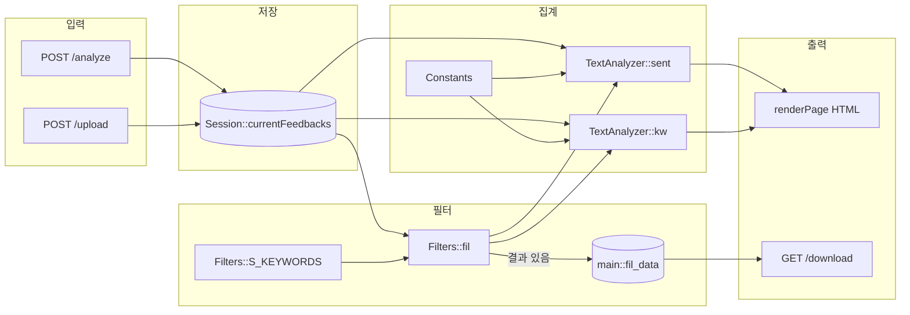
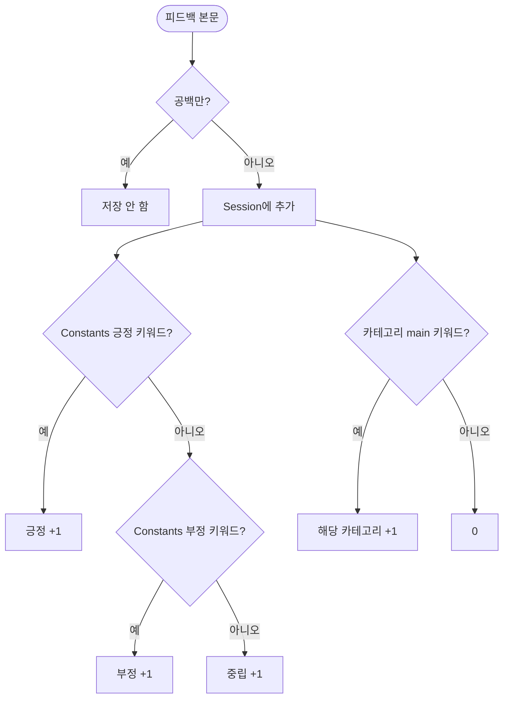
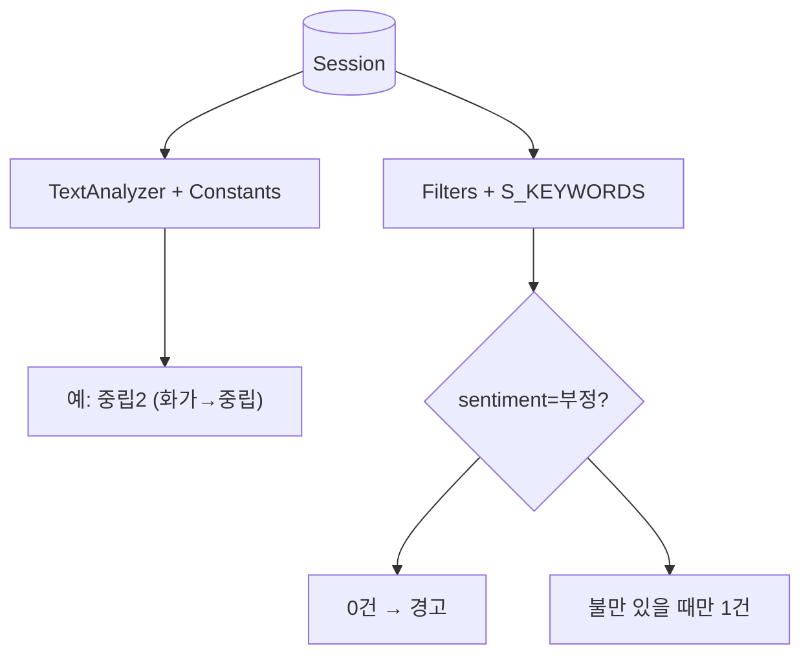
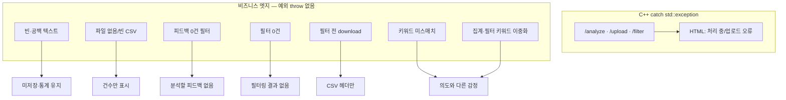

# `src` 레거시 동작 분석 보고서 — FeedbackAnalyzer_08

**작성일**: 2026-05-22  
**프로젝트**: `C:\DEV\FeedbackAnalyzer_08`  
**범위**: `src/cpp` (현행 실행 코드), `src/features` (목표 BDD 계약)  
**검증**: `build/feedback_analyzer.exe` 로컬 실행 · HTTP 요청 실측  
**코드 변경**: 없음 (분석·문서만)

---

## 1. 요약

| 항목 | 내용 |
|------|------|
| 빌드 산출물 | `feedback_analyzer` (CMake → `src/cpp` 7개 .cpp + `main.cpp`) |
| 아키텍처 | 레이어 분리 없는 **플랫 모놀리스**; `main.cpp`가 HTTP·HTML·파싱·라우팅 담당 |
| 분석 방식 | `Constants` 키워드 부분 문자열 매칭 (`find`) |
| 상태 저장 | `Session::currentFeedbacks`(전체), `main::fil_data`(필터 성공 시만) |
| 핵심 리스크 | 감정 키워드 **이중 정의**, 집계·필터·다운로드 **불일치**, 키워드 미스매치 시 **오류 없이 중립** |

---

## 2. `src` 디렉터리 구조

```
src/
├── cpp/                         # CMake 빌드 대상 (실행 코드)
│   ├── main.cpp                 # httplib 서버, HTML, 라우팅 (373행)
│   ├── httplib.h                # HTTP 서버 (서드파티)
│   ├── Feedback.h               # text 필드만 보유
│   ├── Constants.h/cpp          # 감정·카테고리 키워드
│   ├── TextAnalyzer.h           # sent(), kw() 집계
│   ├── Filters.h/cpp            # fil() 필터 (별도 감정 키워드)
│   ├── Session.h/cpp            # 피드백 벡터 보관
│   ├── UIComponents.h/cpp       # UI 카테고리 5종
│   ├── FileHandler.h            # 저장 스텁 (빌드 미포함)
│   └── Logger.h/cpp             # cout/cerr 로깅
└── features/                    # Gherkin 7파일 (빌드·스텝 미연동)
    ├── 01_sentiment_classification.feature
    ├── 02_category_keyword_classification.feature
    ├── … 05, 06, EPIC_*.feature
```

### 2.1 모듈 책임

| 모듈 | 책임 | 의존 |
|------|------|------|
| `Feedback` | 본문 `text` | — |
| `Constants` | `SENTIMENT_KEYWORDS`, `CATEGORY_KEYWORDS` | `init()` 하드코딩 |
| `TextAnalyzer` | 감정·카테고리 **집계** | `Constants` |
| `Filters` | 감정·카테고리 **필터** | `Constants` + `S_KEYWORDS` |
| `Session` | 누적 피드백 | 정적 `vector` |
| `main` | HTTP, `fil_data`, HTML | 위 전부 |

### 2.2 목표 구조와의 gap (`.cursorrules` / PRD)

문서·규칙이 기대하는 `src/boundary`, `control`, `entity`, `data`는 **미구현**. `src/features`의 `UnitRegistry`·`Converter` 시나리오는 **목표 계약**이며 현행 `src/cpp`와 직접 연결되지 않음.

---

## 3. HTTP 엔드포인트·데이터 흐름

### 3.1 엔드포인트

| 메서드 | 경로 | 동작 |
|--------|------|------|
| GET | `/` | 초기 HTML, `Session` 조회 |
| POST | `/analyze` | 텍스트 입력 → Session 적재 → 집계 → HTML |
| POST | `/upload` | CSV multipart → 첫 컬럼 적재 (헤더 스킵) |
| POST | `/filter` | 감정·카테고리 필터 → 재집계, `fil_data` 갱신 |
| GET | `/download` | `fil_data` 기준 CSV (UTF-8 BOM) |

### 3.2 전체 파이프라인



**주의**: 다운로드는 `Session`이 아니라 **`fil_data`**만 사용한다. 필터를 거치지 않으면 CSV 본문이 비어 있을 수 있다.

---

## 4. 문장 1건 분류 로직 (집계)



집계 우선순위 (`TextAnalyzer::sent`): **긍정 → 부정 → (둘 다 없으면) 중립**.  
카테고리 (`kw`): 각 카테고리의 **`main` 그룹만** 카운트.

---

## 5. 실행 실측 예시 (2026-05-22)

서버: `.\build\feedback_analyzer.exe` · `http://localhost:8080`

### 5.1 시나리오 A — 3건 연속 입력

| 순서 | 입력 문장 | 집계 감정 | 배송 카운트 | 비고 |
|------|-----------|-----------|-------------|------|
| 1 | 감사합니다. 정말 만족합니다. | 긍정 | 0 | `"감사"`, `"만족"` 매칭 |
| 2 | 배송이 너무 늦어요. 화가 납니다. | **중립** | 1 | `"화남"`≠`"화가"` → 부정 미매칭 |
| 3 | 전반적으로 무난했습니다. | 중립 | 0 | `Constants`에 `"무난"` 없음 |

**3건 후 집계**: 긍정 1 · 중립 2 · 부정 0 · 배송 1

**서버 로그 (발췌)**:

```
INFO: 감사합니다. 정말 만족합니다.
INFO: 현재 1개의 피드백이 입력되었습니다.
INFO: 감성 분석 완료
…
INFO: 배송이 너무 늦어요. 화가 납니다.
INFO: 전반적으로 무난했습니다.
INFO: 현재 3개의 피드백이 입력되었습니다.
```

### 5.2 시나리오 B — 필터 `감정=부정`

- Session 3건 기준: 집계상 **부정 0건**
- `filters.fil(..., "부정", "전체")` → **0건**
- UI: `필터링 결과가 없습니다.` (warning)
- `fil_data` **미갱신** → `/download`는 헤더 `text`만

### 5.3 시나리오 C — `불만` 포함 1건

| 입력 | 집계 | 필터(부정) | download |
|------|------|------------|----------|
| 배송이 너무 늦어요. **불만**입니다. | 부정 1, 배송 1 | 1건 통과 | `text` + 해당 본문 1행 |

### 5.4 집계 vs 필터 이중 경로



---

## 6. 예외·엣지 케이스

### 6.1 분류 맵



### 6.2 상황별 표

| # | 상황 | 경로 | 사용자 표시 | 코드 근거 |
|---|------|------|-------------|-----------|
| 1 | 빈/공백만 텍스트 | `/analyze` | 건수 불변, 통계는 기존 | `text.empty()`, trim 후 미추가 |
| 2 | `text` 필드 누락 | `/analyze` | 빈 문자열과 동일 | `params["text"]` |
| 3 | 파일 미첨부 | `/upload` | 추가 0건 | `has_file` false |
| 4 | 빈 CSV / 헤더만 | `/upload` | 0건 추가 | 첫 줄 스킵, 빈 행 skip |
| 5 | 피드백 없이 필터 | `/filter` | ⚠ 분석할 피드백 없음 | `main.cpp` L343–346 |
| 6 | 필터 0건 | `/filter` | ⚠ 필터링 결과 없음 | L338–341 |
| 7 | 필터 없이 다운로드 | `/download` | `text` 헤더만 | `fil_data` empty |
| 8 | 키워드 부분 불일치 | `/analyze` | **오류 없이** 중립 | `containsAny` 부분 문자열 |
| 9 | `std::exception` | POST 3종 | 🔴 처리/업로드 오류 | catch L282, L314, L348 |
| 10 | `/download` | GET | try/catch **없음** | L356–366 |

### 6.3 레거시 구조적 이슈 (리팩터링 관점)

| 이슈 | 설명 | PRD/규칙 대응 |
|------|------|----------------|
| 감정 키워드 이중화 | `Constants::SENTIMENT_KEYWORDS` vs `Filters::S_KEYWORDS` | 단일 `UnitRegistry` 목표 |
| 카테고리 필터 vs 집계 | `kw()`는 `main`만; `fil()` 카테고리는 **서브그룹** | main-only 집계 계약 |
| 전역 mutable | `fil_data`, `Session`, `globalSent`/`globalKw` | Session port 주입 |
| `FileHandler` | cout 스텁, CMake 미포함 | Lava Flow |
| Gherkin 미연동 | `src/features` 7파일, 테스트 디렉터리 없음 | Catch2 RED 우선 |

---

## 7. 시나리오 타임라인 (ASCII)

```
[GET /]           Session: []

[analyze ①]       "감사합니다. 정말 만족합니다."
                  → 긍정1

[analyze ②]       "배송이 너무 늦어요. 화가 납니다."
                  → 중립+1, 배송+1  (부정 아님)

[analyze ③]       "전반적으로 무난했습니다."
                  → 중립+1

[filter 부정]     0건 → ⚠, fil_data 비움

[download]        text\n  (데이터 없음)

─── 대조 ───

[analyze]         "…불만입니다."  → 부정1, 배송1
[filter 부정]     1건 → fil_data 갱신
[download]        본문 1행 출력
```

---

## 8. 참조 코드 위치

| 관심사 | 파일·위치 |
|--------|-----------|
| 라우팅·HTML | `src/cpp/main.cpp` L233–372 |
| 집계 감정 | `src/cpp/TextAnalyzer.h` `sent()` |
| 집계 카테고리 | `TextAnalyzer.h` `kw()` — `main` only |
| 필터 | `src/cpp/Filters.h` `fil()` |
| 키워드 정의 | `src/cpp/Constants.cpp` |
| 필터 감정 키워드 | `src/cpp/Filters.cpp` `initFilterKeywords()` |

---

## 9. 결론·권고

1. **현행 제품**은 `src/cpp` 단일 실행 파일로 동작하며, 입력→Session→집계→(선택)필터→HTML/CSV 흐름이 명확하다.  
2. **실측**상 자연어가 부정처럼 읽혀도 등록 키워드와 문자열이 맞지 않으면 **중립**으로 집계되며, 이는 사용자에게 오류로 노출되지 않는다.  
3. **필터·다운로드**는 집계와 다른 규칙·저장소를 사용하므로, Phase 5 목표(`Converter` 단일 경로)로의 리팩터링 시 우선 RED 테스트 대상으로 삼는 것이 적절하다.  
4. 본 보고서는 `src/features` 및 `docs/PRD.md`의 목표 계약과 **의도적 gap**을 전제로 한다.

---

## 10. 관련 문서

| 문서 | 역할 |
|------|------|
| [README.md](../README.md) | 상단: 레거시 실행법 / 하단: Phase 5 계약 |
| [docs/PRD.md](../docs/PRD.md) | 인수·계약 정본 |
| [Report/01_Spec.md](./01_Spec.md) | 세션·문서 정합 보고 |
| [src/features/](../src/features/) | 목표 Gherkin 시나리오 |
