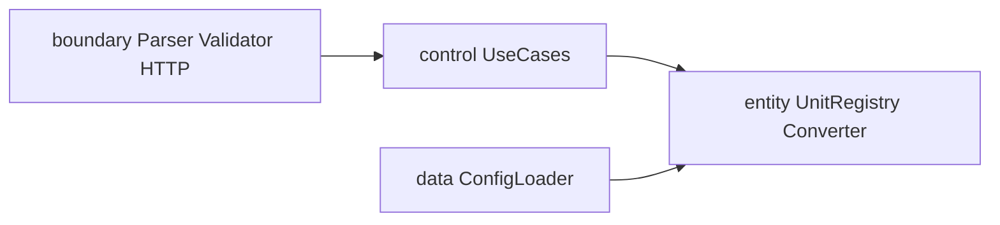

# TDD RED·테스트 계획 세션 보고서 — FeedbackAnalyzer_08

**작성일**: 2026-05-22  
**프로젝트**: `C:\DEV\FeedbackAnalyzer_08`  
**주제**: 앵커 샘플 선정 · 테스트 계획 · Catch2 RED · 결함 목록 · README To-Do 동기화  
**앵커 샘플**: `"배송이 너무 늦어요. 불만입니다."`  
**정본**: [docs/PRD.md](../docs/PRD.md) · [docs/test_plan.md](../docs/test_plan.md) · [project_purpose.md](../project_purpose.md)

---

## 1. 세션 목적·범위

| 항목 | 내용 |
|------|------|
| **목적** | Phase 5 계약에 맞는 **RED 단계** 산출물 정리 — 테스트 계획, Catch2 스켈레톤, 결함 추적, README 체크리스트 |
| **역할** | 시니어 QA 리드 · C++17 · CMake · Catch2 v3 |
| **In** | 앵커 기반 Domain/Boundary/Data 테스트, `defect_list.md`, README RED To-Do |
| **Out** | ML 분석, Trend/File DB, 프로덕션 `src/entity` GREEN 완료 |

---

## 2. 작업 타임라인

| 순서 | 사용자 요청 | 산출물 | 비고 |
|------|-------------|--------|------|
| 1 | 샘플 예제 1개 선택 (test_plan 기반) | 구두·문서 선정 결과 | `src/README.md` 없음 → 루트 README·PRD 기준 |
| 2 | `docs/test_plan.md` 작성 | [docs/test_plan.md](../docs/test_plan.md) | Catch2·경계·gcov/lcov |
| 3 | RED To-Do 명령 프롬프트 (Track A/B, COV) | 채팅 산출 (한 줄 프롬프트) | 14+3 항목 |
| 4 | README `## RED 단계 To-Do 리스트` 삽입 | [README.md](../README.md) 98행~ | defect_list 링크 포함 |
| 5 | Catch2 테스트 작성 (타입별 5+ · RED) | `tests/*.cpp`, `include/`, `red_phase_stubs.cpp`, `CMakeLists.txt` | 30건 → 스텁 GREEN 시 PASS |
| 6 | QA 결함 분석·최소 수정 | [docs/defect_list.md](../docs/defect_list.md), 스텁 구현 | 빌드 성공·ctest 30/30 (당시) |
| 7 | README RED To-Do 업데이트 실행 | README 체크박스·현황 문구 | 4/7 → 7/7 스켈레톤 반영 전 |
| 8 | Catch2 스켈레톤 (`FAIL("RED")` only) | `domain/boundary/data_tests.cpp` 재작성 | **38건** |
| 9 | 확인 (빌드·ctest·README 정합) | README 현황 **0/38 PASS** | 본 보고서 |

---

## 3. 앵커 샘플 선정 (골든)

### 3.1 선택 예제

**입력**: `배송이 너무 늦어요. 불만입니다.`

| 축 | 기대 |
|----|------|
| 감정 | `부정` (`불만` 키워드) |
| 카테고리 | `배송` 1건 (`배송` ∈ main) |
| 집계 | `부정=1`, `배송=1` |
| 확장 | 필터 부정+배송 1건, CSV 1행 (AC-05) |

### 3.2 선택 이유

1. **한 문장**으로 감정 Hub 변환 + 카테고리 main 집계를 동시 검증 (README 2·3번, PRD F-02).
2. `"배송이 너무 늦어요. 화가 납니다."`와 대비해 happy path(부정) vs 경계(키워드 미매칭→중립)를 같은 플랜에 펼칠 수 있음 ([project_purpose.md](../project_purpose.md) §2.3, DEF-L01).

### 3.3 README 요구사항 매핑

| README 주요 기능 | 번호 |
|------------------|------|
| 키워드 기반 피드백 분류 | 2번 |
| 감정 분석 (긍/부/중) | 3번 |
| 필터링 (확장) | 4번 |

> **참고**: `meter/feet`, `3.28084` 등 UnitConverter 잔재는 **도메인 외** (README 80행).

---

## 4. 산출 문서·코드 목록

### 4.1 문서

| 경로 | 역할 |
|------|------|
| [docs/test_plan.md](../docs/test_plan.md) | 테스트 계획 정본 (P0~P3, BND/DEF, gcov/lcov) |
| [docs/defect_list.md](../docs/defect_list.md) | DEF-001~008(스텁), DEF-L01~L10(레거시) |
| [README.md](../README.md) § RED To-Do | Track A/B 체크리스트, 커버리지, 결함 연결 |

### 4.2 테스트 인프라 (신규)

```
include/
  entity/     Types.hpp, UnitRegistry.hpp, Converter.hpp
  boundary/   FeedbackParser.hpp, FilterValidator.hpp
  data/       ConfigLoader.hpp
tests/
  domain_tests.cpp      (13 TEST_CASE)
  boundary_tests.cpp    (15 TEST_CASE)
  data_tests.cpp        (10 TEST_CASE)
  red_phase_stubs.cpp   (FEEDBACK_ANALYZER_RED_PHASE=ON)
  fixtures/             registry_*.yaml/json
CMakeLists.txt          Catch2 FetchContent, feedback_analyzer_tests
```

### 4.3 Catch2 진화 (본 세션)

| 단계 | 테스트 본문 | ctest | 비고 |
|------|-------------|-------|------|
| A. 스텁 no-op | `REQUIRE` 전체 | 26/30 FAIL | `classify` 항상 중립 |
| B. 스텁 최소 GREEN | `REQUIRE` 전체 | **30/30 PASS** | `red_phase_stubs.cpp` if-else |
| C. **스켈레톤 (현재)** | **`FAIL("RED")` only** | **0/38 PASS** | RED 원칙 복귀 |

---

## 5. README RED To-Do — 최종 정합 (확인 시점)

### 5.1 현황 문구

- Catch2 스켈레톤 **38건** · ctest **0/38 PASS** · GREEN 미착수
- 레거시 `src/cpp` DEF-L01~L09 **Open**

### 5.2 체크리스트 의미

| 표시 | 의미 |
|------|------|
| `[x]` Track A/B | 해당 TC용 **TEST_CASE 스켈레톤 존재** (본문 `FAIL("RED")`) |
| `[ ]` 커버리지 | COV-01~03 미실행 |
| `[x]` defect_list | [docs/defect_list.md](../docs/defect_list.md) 작성 |
| `[ ]` 회귀 통과 | GREEN·레거시 수정 전 |

### 5.3 Track ↔ TEST_CASE 매핑

| TC | TEST_CASE (스켈레톤) |
|----|----------------------|
| TC-A-01 | `test_parse_plain_empty_text_returns_empty_text` |
| TC-A-02 | `test_parse_labelbody_colon_missing_throws_colon_missing` |
| TC-A-03 | `test_parse_labelbody_unknown_emotion_rejects_hub_substitute` |
| TC-A-04 | `test_upload_csv_missing_text_column_rejects` |
| TC-A-05 | `test_analyze_trim_anchor_stored_text` |
| TC-A-06 | `test_filter_negative_shipping_session_one_item` |
| TC-A-07 | `test_download_csv_anchor_one_data_row`, `test_download_empty_fil_data_returns_not_found` |
| TC-B-01 | `test_classify_anchor_text_returns_negative` |
| TC-B-02 | `test_aggregate_anchor_single_negative_and_shipping_one` |
| TC-B-03 | `test_aggregate_subkeyword_only_shipping_zero` |
| TC-B-04 | `test_filter_negative_shipping_returns_anchor_only` |
| TC-B-05 | `test_classify_coexisting_keywords_returns_positive` |
| TC-B-06 | `test_classify_near_negative_purpose_line_returns_negative` |
| TC-B-07 | `test_aggregate_three_feedbacks_sum_equals_three`, `test_classify_neutral_text_returns_hub_neutral` |

---

## 6. 결함 요약 ([defect_list.md](../docs/defect_list.md))

### 6.1 스텁 결함 (DEF-001~008) — 스켈레톤 단계에서 재현

| ID | Severity | 요약 | 스텁 GREEN 시 |
|----|----------|------|---------------|
| DEF-001 | Critical | `classify` → 항상 중립 | 키워드 if-else로 해소 가능 |
| DEF-002 | Critical | `aggregate` 빈 map | 집계 로직 |
| DEF-003 | Critical | `filter` 0건 | classify 연동 |
| DEF-004~006 | Critical | Parser/Validator 무검증 | Boundary 구현 |
| DEF-007~008 | Major | loadConfig/register | Data 구현 |

### 6.2 레거시 결함 (DEF-L01~L10) — **Open**

| ID | Severity | 요약 |
|----|----------|------|
| DEF-L01 | Critical | `화가` vs `화남` → 집계 중립 (GH-01 불일치) |
| DEF-L02 | Critical | `TextAnalyzer` vs `Filters` 이중 SENTIMENT |
| DEF-L03 | Major | 집계 main vs 필터 서브그룹 |
| DEF-L04~L09 | Major/Minor | EMPTY_TEXT, 파싱, CSV, download 미계약 |
| DEF-L10 | Info | `containsAny` 중복 |

---

## 7. 빌드·검증 명령

```powershell
cd C:\DEV\FeedbackAnalyzer_08
cmake -S . -B build -G "MinGW Makefiles" -DCMAKE_CXX_COMPILER=C:/mingw64/bin/g++.exe
cmake --build build
ctest --test-dir build --output-on-failure
```

**현재 기대 (스켈레톤)**:

```
0% tests passed, 38 tests failed out of 38
```

**GREEN 단계 기대 (미래)**:

```
100% tests passed, 0 failed out of 38
```

---

## 8. RED 명령 프롬프트 (워크숍용)

세션 중 정리한 한 줄 프롬프트 형식 (채팅 산출):

```
/red B-01 tests/domain/test_classify_anchor.cpp [domain] classify(앵커) → sentimentId 부정
/cov COV-01 build-cov ENABLE_COVERAGE ctest domain lcov extract entity → lines>=95%
/red-done domain13+boundary15+data10=38 RED 전부FAIL
```

전체 목록은 대화 로그 또는 [docs/test_plan.md](../docs/test_plan.md) §2.3 P0 케이스 ID 참조.

---

## 9. 아키텍처·다음 단계

### 9.1 목표 BCE (미구현)



현행: `src/cpp` 레거시 + `tests/red_phase_stubs.cpp` 단일 파일 스텁.

### 9.2 권장 순서 (GREEN)

1. `src/entity` — `Converter`/`UnitRegistry` (TC-B, registerUnit)
2. `src/boundary` — Parser, Validator (TC-A 파싱·필터)
3. `src/data` — `loadRatios` JSON/YAML
4. `main.cpp` 분리 — HTTP TC-A-04~07
5. ctest 38/38 → README “회귀 통과” `[x]`
6. COV-01~03, `scripts/check_coverage.sh`

---

## 10. 세션 결론

| 항목 | 상태 |
|------|------|
| 테스트 계획 | [docs/test_plan.md](../docs/test_plan.md) **완료** |
| 앵커 골든 | **부정 + 배송 1** 고정 |
| Catch2 스켈레톤 | **38건**, 전건 `FAIL("RED")` |
| README To-Do | Track A/B **7/7 스켈레톤 `[x]`**, ctest **0/38** 반영 |
| 결함 목록 | [docs/defect_list.md](../docs/defect_list.md) **작성** |
| 레거시 앱 | **Open** — GREEN·E2E 별도 Epic |

본 세션은 **“실패하는 테스트로 계약 고정”(RED)** 까지 완료했고, **구현(GREEN)** 과 **레거시 제거**는 후속 작업이다.

---

## 11. 관련 보고서

| 파일 | 관계 |
|------|------|
| [00_src_레거시_동작_분석_보고서.md](./00_src_레거시_동작_분석_보고서.md) | 앵커·화가/불만 실측, 필터 불일치 |
| [01_Spec.md](./01_Spec.md) | 이전 세션 README·PRD 정합 |
| [docs/test_plan.md](../docs/test_plan.md) | 테스트 설계 정본 |
| [docs/defect_list.md](../docs/defect_list.md) | 결함 추적 정본 |
